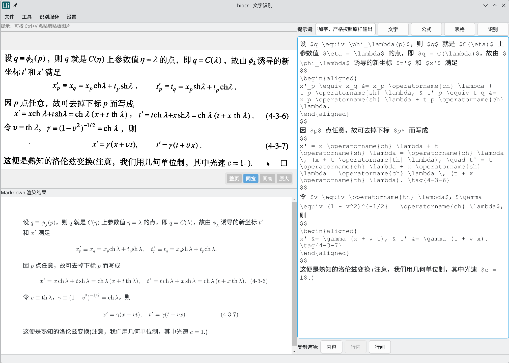

# HiOCR

该项目是一个基于 Qt6 框架开发的 Linux 桌面光学字符识别（OCR）工具，支持识别文字、公式和表格，特别针对 Linux 桌面 Wayland 环境及多服务模型场景进行了优化，在 KDE 桌面下体验最好。



---

## 1. 项目概述

HiOCR 旨在提供高效的屏幕截图识别能力，支持将图片中的文字、数学公式、表格转换为 Markdown 格式。其核心特性包括：

*   **多服务配置管理**：支持配置多个识别服务（本地 LLM 或远程 API），支持 API Key 和模型名称配置，支持“仅保留一个”或“并行运行”多种服务模式。
*   **智能故障转移**：支持全局默认配置与特定服务配置。当全局连接失败时，可自动尝试启动并切换到预设的本地服务。
*   **分类型脚本管道**：支持为文字、公式、表格、纯数学公式分别配置不同的复制前处理脚本，并支持快捷键手动触发处理。
*   **高精度渲染**：基于 QWebEngineView 和 Temml 库提供高质量的 LaTeX 公式渲染，支持多种数学字体及字体大小调节。
*   **原生集成**：深度适配 Wayland（XDG Portal）和 X11，支持 KDE (KGlobalAccel) 和通用 Wayland (GlobalShortcuts Portal) 的全局快捷键。

---

## 2. 架构设计

项目采用分层架构，核心逻辑与 UI 解耦，通过 `AppController` 进行全局调度。

### 2.1 核心模块

*   **AppController**: 应用程序核心控制器，负责协调模块交互、单实例通信、服务状态同步及业务逻辑流转。
*   **MainWindow**: 主视图层，采用 `QToolBar` 实现现代菜单风格，集成服务选择器、脚本开关状态栏。
*   **ServiceManager**: 服务生命周期管理器，支持启动子进程（LLM 服务）、进程组管理、空闲超时关闭及故障监控。
*   **RecognitionManager**: 识别逻辑管理器，处理防抖、请求超时、API Key/Model 注入及网络错误重试。
*   **CopyProcessor**: 复制处理管道，实现内容类型检测（如纯公式判定）并调用外部脚本进行预处理。
*   **SettingsManager**: 配置管理单例，支持多服务列表序列化、类型安全配置读写及全局/服务级配置切换。

### 2.2 数据流

1.  **输入源**: 用户触发截图/粘贴 -> `ScreenshotManager` -> 生成 `QImage`。
2.  **服务判定**: `AppController` 检查当前选中的服务 ID。若为空则使用全局默认配置；否则使用特定服务配置（URL, Key, Model）。
3.  **识别请求**: `RecognitionManager` 组装请求体 -> `NetworkManager` 发送 POST（支持超时中断）。
4.  **故障恢复**: 若请求失败（如连接拒绝），且开启了自动启动功能，`AppController` 自动切换到默认本地服务并启动进程，随后重试请求。
5.  **结果处理**: 返回 Markdown -> `MarkdownRenderer` 渲染。
6.  **智能复制**: 用户复制 -> `CopyProcessor` 判定内容类型 -> 查找对应脚本 -> 执行并写入剪贴板。

---

## 3. 编译指南

### 3.1 依赖项

*   **CMake** (>= 3.20)
*   **C++17** 编译器 (GCC/Clang)
*   **Qt6** 组件: `Core`, `Gui`, `Widgets`, `Network`, `WebEngineWidgets`, `WebChannel`, `DBus`
*   **可选依赖**: `KF6GlobalAccel` (用于 KDE 原生快捷键支持)

### 3.2 编译步骤

```bash
git clone https://gitee.com/ylxdxx/hiocr
cd hiocr
mkdir build && cd build
cmake ..
make
sudo make install
```

---

## 4. 功能模块详解

### 4.1 多服务配置系统

程序支持配置多个识别服务，解决了切换模型需重启程序的痛点。

*   **服务配置项**:
    *   `name`: 服务名称。
    *   `start_command`: 启动命令（如 `llama-server -m model.gguf --port 8080`）。
    *   `server_url`: API 地址。
    *   `api_key`: API 密钥（支持本地服务留空）。
    *   `model_name`: 指定模型名称（如 `qwen-vl-plus`, `deepseek-chat`）。
    *   `text_prompt` / `formula_prompt` / `table_prompt`: 该服务专属的提示词。
*   **运行模式**:
    *   **单服务模式**: 切换服务时自动停止其他服务，节省资源。
    *   **并行模式**: 允许多个服务同时后台运行，实现零延迟切换。
*   **全局默认**:
    *   界面支持选择“全局默认”，此时使用 Settings 中的默认 URL、Key 和 Model，适用于远程 API 直连场景。

### 4.2 智能复制与外部处理

复制功能支持极高自由度的自定义，以适应不同排版需求。

*   **内容检测**: 自动识别内容是否为“纯数学公式”（如仅包含 `$$..$$` 或 `$..$`），以此决定使用“纯公式脚本”还是“普通公式脚本”。
*   **分类型脚本**:
    *   支持为 **文字**、**公式**、**表格**、**纯数学公式** 分别配置外部处理脚本。
    *   脚本通过 `stdin` 接收文本，处理后的 `stdout` 结果写入剪贴板。
*   **快捷键触发**:
    *   除了自动触发，可为每种处理类型绑定快捷键（如 `Ctrl+Shift+T` 强制使用文字脚本处理当前内容），实现手动干预。

### 4.3 图像处理与截图

*   支持 XDG Portal（Wayland 截图）与 X11 回退。
*   区域选择器自动适配高 DPI 屏幕，精确映射物理像素与逻辑坐标。
*   支持命令行直接传入图片路径或结果文本，方便外部脚本调用。

---

## 5. 配置系统

配置文件存储于 `~/.config/hiocr/hiocr.conf`。

### 5.1 服务配置示例 (JSON 序列化)

配置存储在 `services/list` 键下，结构如下：

```json
[
  {
    "id": "uuid-1",
    "name": "本地 LLaVA",
    "start_command": "llama-server -m llava-v1.5-7b.Q4_K_M.gguf --port 8080",
    "server_url": "http://localhost:8080/v1/chat/completions",
    "model_name": "llava-v1.5",
    "text_prompt": "Extract text:",
    "formula_prompt": "Latex formula:",
    "table_prompt": "Markdown table:"
  },
  {
    "id": "uuid-2",
    "name": "远程 Qwen",
    "start_command": "",
    "server_url": "https://dashscope.aliyuncs.com/compatible-mode/v1/chat/completions",
    "api_key": "sk-xxxxxxxx",
    "model_name": "qwen-vl-max"
  }
]
```

### 5.2 快捷键配置

支持配置以下快捷键：

*   **识别类**: 截图、文字识别、公式识别、表格识别。
*   **处理类**: 文字处理脚本、公式处理脚本、表格处理脚本、纯数学公式脚本。

### 5.3 高级参数

支持在设置界面直接编辑 JSON 格式的请求参数，例如：

```json
{
    "temperature": 0.5,
    "max_tokens": 8192,
    "cache_prompt": false,
    "enable_thinking": false
}
```

---

## 6. 命令行接口

*   `hiocr`: 启动 GUI（单实例模式）。
*   `hiocr -i <path>`: 启动并加载指定图片。
*   `hiocr -i <path> -r "<text>"`: 加载图片并直接显示结果文本（跳过识别，用于集成外部工具）。
*   `hiocr --verbose`: 输出详细调试日志。

---

## 7. 开发者指南

### 7.1 单实例机制

使用 `QLocalServer` 实现。后续实例启动时会向已运行的实例发送 JSON 消息：

```json
{
    "image": "/absolute/path/to/image.png",
    "result": "optional text"
}
```

### 7.2 网络层健壮性

`NetworkManager` 内部集成了 `QTimer` 实现请求超时控制，超时时间可在设置中配置（默认 30 秒）。超时后会自动中断请求并提示，避免无限等待。

---

## 8. 使用示例

### 8.1 配置远程 API (如通义千问)

1.  打开设置 -> 识别服务管理 -> 点击“添加”。
2.  填写服务名称（如“通义千问”）。
3.  启动命令留空。
4.  服务地址填写：`https://dashscope.aliyuncs.com/compatible-mode/v1/chat/completions`。
5.  填写 API Key 和模型名称（如 `qwen-vl-plus`）。
6.  保存，并在工具栏“当前服务”下拉框中选择该服务即可使用。

### 8.2 配置本地模型自动启动

1.  在服务列表中添加本地服务，配置好启动命令（如 `ollama run llava` 或 `llama-server ...`）。
2.  在服务列表右键或通过“设为默认启动”按钮，将其设为默认本地服务。
3.  勾选“设置” -> “行为” -> “远程连接失败自动启动本地服务”。
4.  当你使用全局默认（远程）连接失败时，程序将自动切换并启动该本地服务进行重试。

### 8.3 使用脚本处理文本

1.  例如编写 Python 脚本 `format_text.py`：
    ```python
    import sys
    text = sys.stdin.read()
    # 去除换行，添加标点等逻辑
    print(text.replace('\n', ' '))
    ```
2.  在设置 -> 复制前外部程序处理 -> 文字处理 -> 命令栏填入：`python3 /path/to/format_text.py`。
3.  勾选工具栏上的“脚本” -> “文字”开关。
4.  识别完成后点击复制，文本将自动经过脚本处理。

## ToDo

- **静默模式支持**：当前的识别，每次都要弹出主窗口，对于大量频繁的识别，效率不高，后续将支持静默识别（不展示主窗口，可通过托盘状态、鼠标状态、悬浮小球、系统通知发送是否识别完成提示，提示内容分为三种，识别错误、识别中、识别完成）
- **历史记录管理**: 增加本地识别历史记录查看与管理功能。
- **流式输出支持**：当前是等待识别结果全部完成后再加载显示，对于大长图不友好，要等很久，后续将支持边识别边处理边显示，与当前网页使用大模型的效果一样
